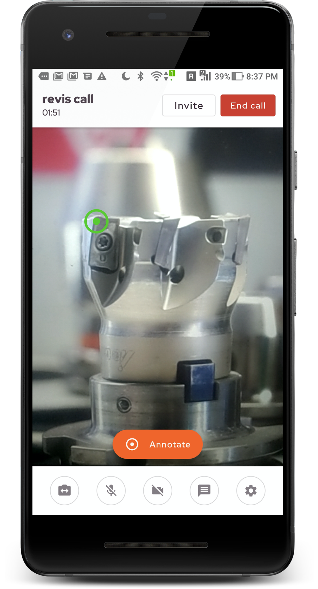

Revis
=====

A video-chat application aimed towards machine manufacturers and machine servicing firms. Featuring real-time video calls, messaging, and smart annotations, placing a clear emphasis on usability for the end-user.

**Demo and Project Pitch** : [https://www.youtube.com/watch?v=PWTptrXVrBE](https://www.youtube.com/watch?v=PWTptrXVrBE)

**Project Page** : [https://www.cdtm.de/mpd/20-1/revis/](https://www.cdtm.de/mpd/20-1/revis/)

Setup Overview
-----------------
* Kotlin
* MVVM Clean Architecture
* Dagger2
* Navigation Component
* Databinding
* Android Material
* Agora API

**Important** : The sourcecode in its current state is meant to be a PoC, built as part of the Managing Product Development course at the [CDTM](https://www.cdtm.de/). If you're planning to build a production app out of this project, [here's](https://docs.google.com/document/d/e/2PACX-1vQq6NvTkZx6DI9McUl51APLMzX3-aSML8qN67VWIEClKZgXQrywnV_PK5kYP6t2ZS4OpPglk8N-6bRx/pub) a useful list of todos to tackle next.

Screens
-------
  

## Build Project
1. Clone the repository -> Folder named **Revis** will be created
2. Install and open Android Studio 4.0 or later
3. Click Open an existing Android Studio Project -> Choose the folder **Revis**
4. Go to Project Pane / File tree on the left, change the view from **Android** to **Project** on the top bar
5. Right click on **Revis** and create a new File and name it **api.properties**
6. Paste this line inside the file.
```
AGORA_APP_ID="<YOUR_AGORA_APP_ID>"
```
7. To obtain the Agora app Id, create a new Agora developer account [here](https://sso.agora.io/en/v2/signup).
8. Create a new project in the Agora console with any project name and choose the authentication mechanism as App ID.
9. Copy the App ID and replace the string **<YOUR_AGORA_APP_ID>** in the api.properties file.
10. Click on Build > Rebuild Project in the top menu bar and the project will be built successfully. (Additionally, Android Studio might also request to install the Android NDK if not found, if so, install and rebuild the project.)
11. Connect an Android device running Android version 21 (Lollipop) or above to the computer. (Important : Agora SDK does not allow the video chat API to run on an Android emulator.)
12. To allow Android Studio to install/debug the device, enable USB Debugging from the Developer Options. (Read [here](https://developer.android.com/studio/debug/dev-options) for instructions.)
13. Once Android Studio recognizes the device, the device name will appear in the Android Studio Toolbar.
14. Click on Run > Run ‘app’ to install the app on the device. Install the app on 2 devices to start a Revis call.

## Start Revis Call

To start a Revis call between 2 devices, one device needs to take the role of a servicing technician and the other device needs to take the role of a machine operator. Since the prototype is not connected to any backend, the user role can be switched through the debug settings found in the home screen > 3-dot menu > Debug Settings.

  

The servicing technician can then initiate the Revis call by tapping on the Create service call button. This creates a new Revis call with a unique service call id, which needs to be shared with the machine operator to join the call. The machine operator can manually enter the service call id or the servicing technician can make use of the provided share functionality to send a deep link through any other app. Revis can then parse the service call id and start the service call when the machine operator taps on this link from any other app after prompting the user.

License
-------
    Copyright 2021 Chandramohan Sudar

    Licensed under the Apache License, Version 2.0 (the "License");
    you may not use this file except in compliance with the License.
    You may obtain a copy of the License at

       http://www.apache.org/licenses/LICENSE-2.0

    Unless required by applicable law or agreed to in writing, software
    distributed under the License is distributed on an "AS IS" BASIS,
    WITHOUT WARRANTIES OR CONDITIONS OF ANY KIND, either express or implied.
    See the License for the specific language governing permissions and
    limitations under the License.
